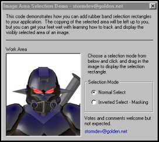



## Image Selection Rectangles

### Description

This code demonstrates how to create image selection rectangles more commonly known as 'Rubber Band Lines'. These will prove useful to those of you who are writing an application which requires the visible display of a selected area in an image. Votes and comments always welcome.
 
### More Info
 

             |
---                |---
**Submitted On**   |2001-01-10 18:49:56
**By**             |[Jonathan Roach](https://github.com/Planet-Source-Code/PSCIndex/blob/master/ByAuthor/jonathan-roach.md)
**Level**          |Beginner
**User Rating**    |4.7 (28 globes from 6 users)
**Compatibility**  |VB 5\.0, VB 6\.0
**Category**       |[Graphics](https://github.com/Planet-Source-Code/PSCIndex/blob/master/ByCategory/graphics__1-46.md)
**World**          |[Visual Basic](https://github.com/Planet-Source-Code/PSCIndex/blob/master/ByWorld/visual-basic.md)
**Archive File**   |[CODE\_UPLOAD136091102001\.zip](https://github.com/Planet-Source-Code/jonathan-roach-image-selection-rectangles__1-14302/archive/master.zip)

